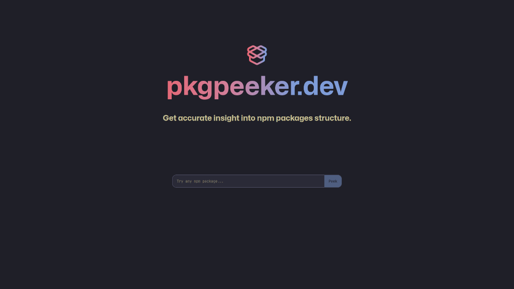
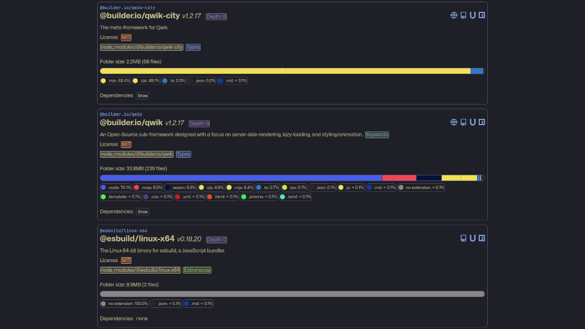

# PkgPeeker

  

## What?

The application spins up an instance of [web container](https://webcontainers.io/) to `npm install` (in the browser) the packages provided by the user.
Upon successful installation, it runs `npm list --all --json` and then parses the resulting dependency tree.
Finally, by accessing the virtual file system provided by [web containers](https://webcontainers.io/), it runs, for each package in the dependency tree, some analysis on the installation folder (inside node_modules folder).

## Why?

Leveraging the possibilities offered by [web containers](https://webcontainers.io/), it becomes possible to explore npm packages and their dependencies through the analysis of the content of the node_modules folder, without installing anything on the computer, as everything happens in the browser.
The data is always up-to-date as only the latest version of the packages gets installed (unless a specific version is provided).

## Installation

`npm install`

## Usage

- Start development server: `npm run dev`
- Run tests in watch mode: `npm run test`
- Run linter: `npm run lint`
- Create production build: `npm run build`
- Serve production build: `npm run preview`

## Built with

[React](https://github.com/facebook/react/) and [WebContainers](https://github.com/stackblitz/webcontainer-core/)

## Author

- **Pierre-Alain Castella** - _Initial work_ - [metapho-re](https://github.com/metapho-re)

## License

This project is licensed under the MIT License - see the [LICENSE](LICENSE) file for details.
